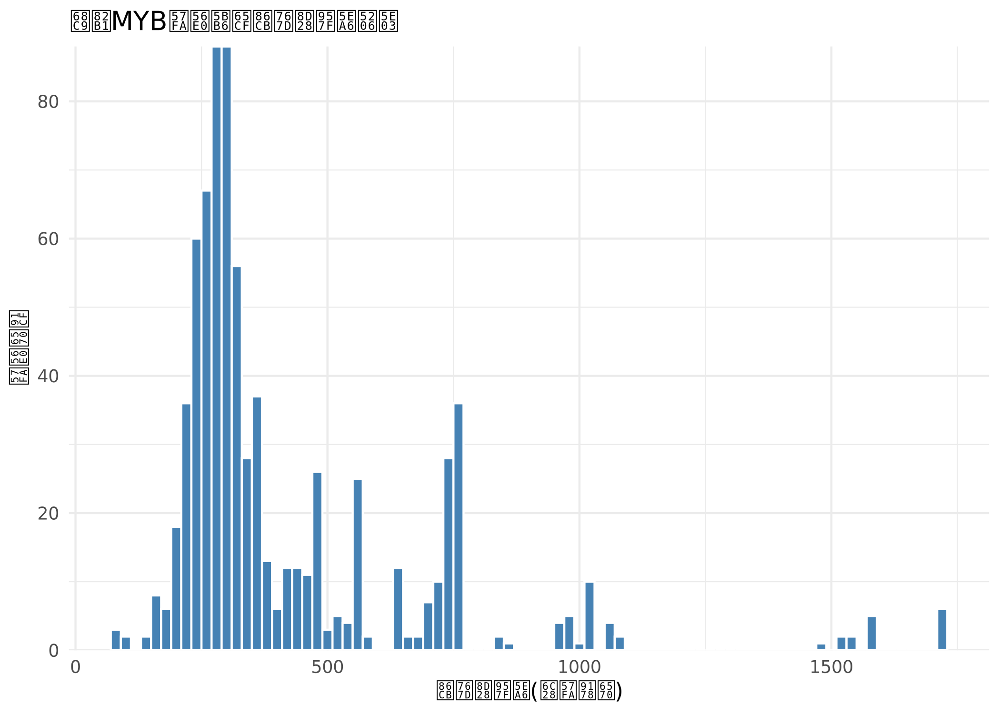
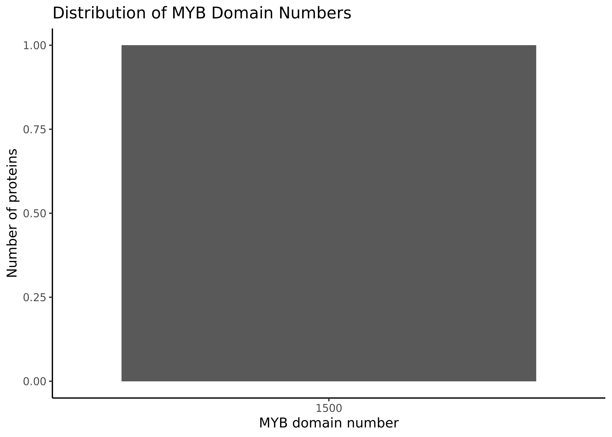

# Genome-wide Identification and Characterization of MYB Gene Family in Cotton


## Overview

MYB transcription factors are one of the largest transcription factor families in plants and play important roles in plant development, metabolism and stress responses.

MYB genes are known to be involved in fiber development and stress responses in cotton, making them important targets for functional studies.

In this project, a genome-wide identification pipeline was established to identify MYB family proteins in cotton based on Hidden Markov Model (HMM)-based domain searching.


## Dataset

Species:
Cotton

Genome assembly:
GCF_007990345.1

Protein dataset:
Cotton whole genome protein sequences downloaded from NCBI.

Number of proteins searched:
111,813

Raw protein sequences are not included in this repository. They can be downloaded from the NCBI Genome database under accession GCF_007990345.1.

## Workflow
Cotton protein sequences | v HMMER search against MYB domain model (PF00249) | v Candidate MYB proteins identification | v Sequence extraction | v Protein length analysis | v Domain number analysis | v Visualization


## Methods

### 1. MYB domain identification

The MYB DNA-binding domain model (PF00249) was used for HMMER-based screening.

High-confidence candidates were selected using:

E-value < 1e-10


### 2. Sequence analysis

Protein sequences were analyzed for:

- Protein length distribution
- MYB domain copy number


### 3. Visualization

Figures were generated using R and ggplot2.


## Results

A total of:

**760 MYB candidate proteins**

were identified from the cotton protein dataset.

Most candidates contain two MYB domains (R2R3-type), consistent with the typical structure of plant MYB transcription factors. These candidates provide a resource for future functional validation, such as VIGS-based screening for genes involved in salt tolerance or fiber development.

### Protein length distribution




### MYB domain number distribution




## Reproducibility

Create environment:conda env create -f environment.yml

Run scripts:python scripts/01_extract_sequences.py
python scripts/02_sequence_statistics.py
python scripts/03_count_domains.py
Rscript scripts/04_plot_length_distribution.R


## Project Structure
. ├── data/ ├── scripts/ ├── results/ ├── environment.yml └── README.md


## Author

ChenBaiyuan
College of Agronomy, Hebei Agricultural University.
This project was completed as part of independent bioinformatics training.

------

# 棉花MYB基因家族的全基因组鉴定与特征分析［中文版］

## 概述

MYB转录因子是植物中最大的转录因子家族之一，在植物发育、代谢和胁迫响应中发挥重要功能。

研究表明，MYB基因参与棉花的纤维发育和胁迫响应，是功能研究的重要靶标。

本项目基于隐马尔可夫模型（HMM）的结构域搜索方法，建立了全基因组鉴定流程，对棉花MYB家族蛋白进行了系统鉴定。


## 数据集

物种：
棉花（*Gossypium hirsutum*）

参考基因组版本：
GCF_007990345.1

蛋白质序列：
从NCBI下载的棉花全基因组蛋白质序列

搜索序列总数：
111,813条

原始蛋白质序列文件不包含在本仓库中，可从NCBI Genome数据库下载（登录号：GCF_007990345.1）。


## 分析流程

棉花全基因组蛋白质序列 → HMMER搜索MYB结构域模型（PF00249）→ 候选MYB蛋白鉴定 → 序列提取 → 蛋白长度分析 → 结构域数量分析 → 可视化


## 方法

### 1. MYB结构域鉴定

使用MYB DNA结合结构域模型（PF00249）进行HMMER搜索，以E-value < 1e-10为标准筛选高可信度候选基因。


### 2. 序列分析

对候选基因的蛋白质序列进行以下分析：

- 蛋白长度分布
- MYB结构域数量


### 3. 可视化

使用R语言的ggplot2包生成统计图表。


## 结果

从棉花蛋白质组中共鉴定到：

**760个MYB候选蛋白**

大多数候选基因含有两个MYB结构域（R2R3型），与已知植物MYB转录因子的典型结构一致。这些候选基因为后续功能验证（如利用VIGS筛选耐盐或纤维发育相关基因）提供了资源。


### 蛋白长度分布


### MYB结构域数量分布


## 可复现性

创建环境：
```bash
conda env create -f environment.yml
```

## 运行脚本

```bash
python scripts/01_extract_sequences.py
python scripts/02_sequence_statistics.py
python scripts/03_count_domains.py
Rscript scripts/04_plot_length_distribution.R
```

## 项目结构
```
.
├── data/
├── scripts/
├── results/
├── environment.yml
└── README.md
```

## 作者
陈栢沅，河北农业大学农学院。
本项目为独立生物信息学学习课题。。